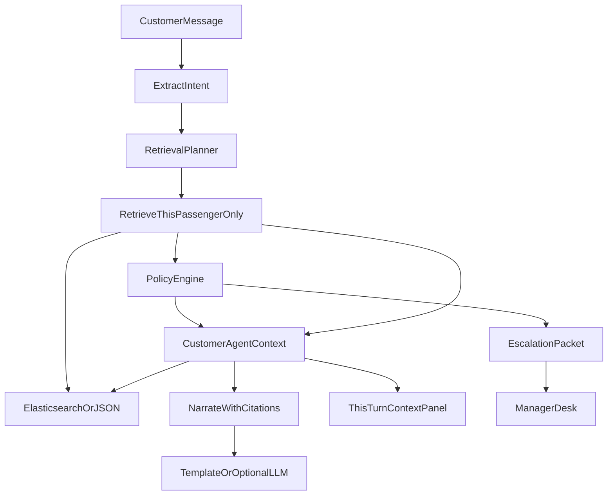

# AeroResolve architecture

## Context-first loop

Intent is extracted first because the plan decides what to retrieve. A status question
fetches a booking and nothing else; a fare waiver additionally fetches the scenario
fixture and the Fare Difference Rule. Retrieval feeds grounding and citation. It never
feeds the decision — `policy/engine.py` holds its own constants.

## Why this split

AIONOS-style constraint: domain-tuned reasoning grounded in **your** data and policies, with human escalation and an auditable record.

- The LLM never receives the other two passengers.
- The LLM never receives `policies.json` to reinterpret.
- Entitlements are computed in `policy/engine.py` and injected as facts.
- The LLM is reachable only through `llm/client.py`, which caps tokens and enforces
  spend ceilings. Any breach returns nothing and the caller uses its deterministic
  path, so cost control can degrade phrasing but never correctness.

## Knowledge base

Elasticsearch indices (when Docker is up): `passengers`, `bookings`, `events`, `cases`,
`graph_edges`, `policy_rules`, `style_samples`, `memories`.

Elasticsearch is a read path, not just a write sink. Three retrievers query it:

| Retriever | Index | Filter | Returns |
| --- | --- | --- | --- |
| `search_policy` | `policy_rules` | `kind`, `rule_id` in plan scope | ranked policy clauses |
| `recall_turns` | `events` | `customer_id`, `kind: turn` | prior turns of this passenger |
| `search_style` | `style_samples` | none | closest tone sample |

`recall_turns` carries a mandatory `customer_id` term filter, so passenger isolation is a
query constraint rather than a convention. `test_retrieval.py` asserts the filter is present
without needing a live cluster.

`policies.json` is indexed at **clause** granularity, not rule granularity. The Delay
Compensation Rule becomes three documents, one per band. A six-hour delay cites only the
more-than-five-hours clause, so the model never receives the ₹500 under-three-hours band it
could misapply. `test_retrieval.py` asserts a four-hour delay never surfaces `500`.

If Elasticsearch is down, `KnowledgeStoreFactory.create("auto")` returns `JsonKnowledgeStore`,
which implements the same retrieval contract with a length-normalized term-overlap scorer in
`products/knowledge/scoring.py`. Ranking is not BM25-identical, which is why the planner
narrows candidates by rule scope before either backend ranks them. Every Elasticsearch search
also falls back to the in-memory implementation on error or an empty result, so a flaky
cluster degrades ranking quality but never the turn.

Clients import `store` from `kb/store.py` and never construct a backend.

## Memory

`remember_fact` writes durable per-passenger facts (escalations raised, simulated actions
already taken) to the `memories` index and the passenger's `known_facts`. A new session for
the same passenger retrieves them, so the agent does not ask a returning passenger to repeat
a case. Long conversations retrieve the top matching prior turns through `recall_turns`
instead of replaying the whole transcript.

Graph edges are written as the conversation happens (`HAS_BOOKING`, `HAS_DISRUPTION`, `EVALUATED_UNDER`, `DENIED_BY`, `ESCALATED_TO`). The manager desk reads that graph; there is no Neo4j.

## Factory products

| Product interface | Concrete products | Factory | Clients |
| --- | --- | --- | --- |
| `IntentExtractor` | heuristic, LLM+fallback | `ExtractorFactory` | `agent/loop.py` |
| `ReplyRenderer` | template, LLM polish | `ReplyFactory` | `agent/loop.py` |
| `PolicyHandler` | status, cancel, delay, fare, exceptions | `PolicyHandlerFactory` | `policy/engine.py` |
| `PassengerKnowledgeStore` | JSON, Elasticsearch | `KnowledgeStoreFactory` | `kb/store.py` singleton |
| `LlmClient` | Gemini, Groq, xAI, OpenAI, disabled | `LlmFactory` | extractor and reply products |
| `PlatformChrome` | customer Resolve, manager CRM | `createPlatform` | Next.js pages |
| `DecisionChrome` | allow/deny/escalate/ask/inform | `createDecisionChrome` | options/queue tables |

## Surfaces

Two Next.js products share `packages/ui` through `createPlatform(id)`:

- **AERO Resolve** (`frontend`, :3000) — passenger options board
- **AERO OPS** (`frontend-manager`, :3001) — supervisor CRM

Customer chrome cannot construct manager chrome. That is the factory boundary.

`ALLOW` → simulated tool (labelled SIMULATED)  
`ASK` → one missing slot  
`DENY` → explain source  
`ESCALATE` → structured case packet with transcript and decisions
