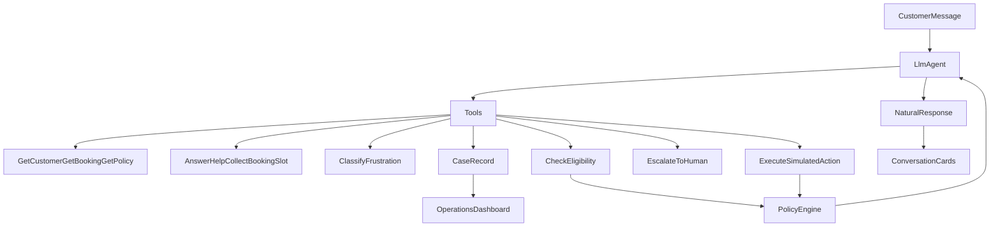

# AeroResolve architecture

Full HLD, engines, sequences, and API map: [system-architecture.md](system-architecture.md).

## Context-first loop

The LLM is the orchestrator: it decides which tool to call, observes the result, and either continues, asks, acts, or escalates. `policy/engine.py` still holds the constants. A tool that returns DENY or ESCALATE cannot be overridden by the model.

If no API key is loaded, the same tools run from a deterministic extractor and a template reply. That path is labelled `agent_mode=fallback`. It is not a live LLM.

## Why this split

AIONOS-style constraint: domain-tuned reasoning grounded in **your** data and policies, with human escalation and an auditable record.

- The LLM never receives the other two passengers.
- The LLM never receives `policies.json` to reinterpret.
- Entitlements are computed in `policy/engine.py` and injected as facts.
- The LLM is reachable only through `llm/client.py`, which caps tokens and enforces
  spend ceilings. Any breach returns nothing and the caller uses its deterministic
  path, so cost control can degrade phrasing but never correctness.
- Every turn records whether it needed a human, whether each claim was cited, how
  long it took, and what it cost. Escalations carry an `EscalationReason` code, so
  the containment rate can be read alongside the authority limits that caused it.

## Knowledge base

Postgres (when `DATABASE_URL` is set) is the system of record for passengers, accounts,
bookings, events, cases, graph edges, memories, and login tokens. Restarting uvicorn
reloads that store; it does not wipe self-service signups.

Elasticsearch indices (when Docker is up, and Postgres is not selected): `passengers`, `bookings`, `events`, `cases`,
`graph_edges`, `policy_rules`, `style_samples`, `memories`.

Elasticsearch is a read path, not just a write sink. Three retrievers query it:

| Retriever | Index | Filter | Returns |
| --- | --- | --- | --- |
| `search_policy` | `policy_rules` | `kind`, `rule_id` in plan scope | ranked policy clauses |
| `recall_turns` | `events` | `customer_id`, `kind: turn` | prior turns of this passenger |
| `search_style` | `style_samples` | none | closest tone sample |

`recall_turns` carries a mandatory `customer_id` term filter, so passenger isolation is a
query constraint rather than a convention. `test_retrieval.py` asserts the filter is present
without needing a live cluster.

`policies.json` is indexed at **clause** granularity, not rule granularity. The Delay
Compensation Rule becomes three documents, one per band. A six-hour delay cites only the
more-than-five-hours clause, so the model never receives the ₹500 under-three-hours band it
could misapply. `test_retrieval.py` asserts a four-hour delay never surfaces `500`.

`KnowledgeStoreFactory.create("auto")` prefers Postgres when `DATABASE_URL` is reachable,
then Elasticsearch, then `JsonKnowledgeStore`. The JSON product implements the same
retrieval contract with a length-normalized term-overlap scorer in
`products/knowledge/scoring.py`. Ranking is not BM25-identical, which is why the planner
narrows candidates by rule scope before either backend ranks them. Every Elasticsearch search
also falls back to the in-memory implementation on error or an empty result, so a flaky
cluster degrades ranking quality but never the turn.

Clients import `store` from `kb/store.py` and never construct a backend.

## Memory

`remember_fact` writes durable per-passenger facts (escalations raised, simulated actions
already taken) to the `memories` index and the passenger's `known_facts`. A new session for
the same passenger retrieves them, so the agent does not ask a returning passenger to repeat
a case. Long conversations retrieve the top matching prior turns through `recall_turns`
instead of replaying the whole transcript.

Graph edges are written as the conversation happens (`HAS_BOOKING`, `HAS_DISRUPTION`, `EVALUATED_UNDER`, `DENIED_BY`, `ESCALATED_TO`, `EXHIBITS_FRUSTRATION`). Operations draws that same store as a live knowledge graph at `GET /api/graph` — Graphify-style, not a side table. The frustration panel also aggregates `EXHIBITS_FRUSTRATION` edges.

## Frustration is a signal, not an authority

`classify_frustration` is a first-class tool with a strict four-key schema. The LLM-orchestrator path registers it and the fallback path calls the same deterministic classifier in `agent/frustration.py`. Downstream code never branches on `agent_mode`.

The classifier can change tone, which already-eligible option is offered first, and whether a supervisor is brought in for duty of care (`EscalationReason.SEVERE_CUSTOMER_DISTRESS`). It cannot grant, deny, or override anything `check_eligibility` / `evaluate_policy` decided. Mutual exclusivity between a refund/cancellation track and goodwill actions (`lounge`, `meal_voucher`) lives in `policy/exclusivity.py` and writes an `offered_actions` list that is always a subset of ALLOW/ASK decisions.

Observations below `KB_AUTO_STORE_THRESHOLD` (default 0.75) are still written, tagged `low_confidence=true`, and excluded from the primary analytics buckets.

## Factory products

| Product interface | Concrete products | Factory | Clients |
| --- | --- | --- | --- |
| `IntentExtractor` | heuristic, LLM+fallback | `ExtractorFactory` | `agent/loop.py` |
| `ReplyRenderer` | template, LLM polish | `ReplyFactory` | `agent/loop.py` |
| `PolicyHandler` | status, cancel, delay, fare, exceptions, booking assist, help | `PolicyHandlerFactory` | `policy/engine.py` |
| `PassengerKnowledgeStore` | Postgres, JSON, Elasticsearch | `KnowledgeStoreFactory` | `kb/store.py` singleton |
| `LlmClient` | Gemini, Groq, xAI, OpenAI, disabled | `LlmFactory` | extractor and reply products |

## Surfaces

Exactly two Next.js apps. They do not share a CRM chrome.

- **Resolution Agent** (`frontend`, :3000) — one passenger conversation, with choices and confirmations inline. CSAT is a post-close popup, not a card that closes the case.
- **Operations** (`frontend-manager`, :3001) — staff-only case audit. Passenger tokens cannot read cases.
- **Exit board** (`/exit`) — look-only upcoming catalog after a completed new-trip request. No ticketing.

`ALLOW` → simulated tool (labelled SIMULATED)  
`ASK` → one missing slot (disruption choice, or booking origin / destination / date / passengers)  
`DENY` → explain source  
`ESCALATE` → structured case packet with transcript and decisions  
`INFORM` → help-guide or completed booking-assist summary; never money

Turns are classified into an `IssueFamily` before a `RequestType` is chosen: **disruption** stays on the packed engine, **assist** collects a new trip without inventing inventory, **help** cites `help.json`, **unclassified** is ordinary conversation on the loaded booking. A look-only flight card is attached only when origin, destination, date, and passengers are all filled.
