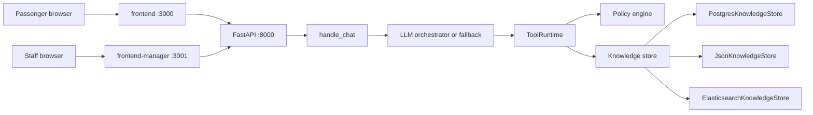
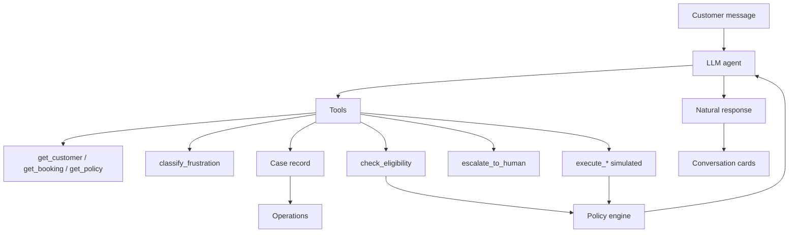

# AeroResolve — System Architecture & HLD

Policy-governed **airline disruption resolution agent** (AIONOS.AI Agentic AI Factory — Assignment 3).

This is not a generic LLM chatbot. **The model orchestrates. Deterministic tools decide.**

Simulated prototype: it does not book real flights, pay refunds, or reserve hotels.

Shorter loop notes live in [architecture.md](architecture.md). Demo beats live in [demo-script.md](demo-script.md).

---

## 1. Product thesis

During a disruption, passengers need a trusted resolution layer that:

1. Translates **this passenger's booking** and **this airline's policy** into options
2. Takes **authorized** action (simulated)
3. Knows when a **human** must take over
4. Leaves an **auditable** record Operations can read

A generic chatbot fails all four: it can invent entitlements, mix passengers, and skip escalation.

---

## 2. High-level design

### 2.1 Design split

| Concern | Owner |
|---|---|
| Wording, tool order, empathy | LLM (optional) |
| Eligibility, money, execute / deny / escalate | Policy engine + tools |
| Isolation (never the other two passengers) | Session + store filters |
| Duty of care | Frustration **signal**, not a policy override |
| Cost / availability | LLM caps → same tools, template reply |

No API key: `agent_mode=fallback`. Policy outcomes stay identical.

### 2.2 System context

```text
Passenger ──► Resolution Agent (:3000) ──► FastAPI (:8000)
Staff     ──► Operations (:3001)       ──┘
                                         │
                    ┌────────────────────┼────────────────────┐
                    │ Policy engine      │ Knowledge store     │
                    │ (code + clauses)   │ Postgres / JSON / ES│
                    │ Frustration clf    │ events / cases /    │
                    │ LLM client (opt.)  │ graph_edges         │
                    └────────────────────┴────────────────────┘
```

Exactly **two** UIs. They do not share CRM chrome.

- **Resolution Agent** (`frontend`, port 3000) — one passenger conversation
- **Operations** (`frontend-manager`, port 3001) — staff-only audit

Passenger tokens cannot read cases. Staff tokens cannot act as a passenger.

### 2.3 Logical components

1. **Conversation loop** (`handle_chat`) — one session, one authenticated customer
2. **Orchestrator** — LLM tool loop (max 8 rounds) **or** extract → plan → retrieve → evaluate → template
3. **Tools** — lookup, eligibility, execute, escalate, classify frustration, answer help, collect booking slots
4. **Policy engine** — handlers per request type (including booking assist and help); closed decision statuses
5. **Issue router** — `IssueFamily` (disruption / assist / help / unclassified) before a `RequestType` is chosen
6. **Exclusivity** — `offered_actions` ⊆ ALLOW/ASK; frustration may **reorder**, never add
7. **Knowledge store** — passengers, bookings, events, cases, memories, graph edges
8. **Operations** — KPIs, containment, frustration analytics, case board, live knowledge graph

### 2.4 Turn pipeline

```text
UNDERSTAND → GROUND → DECIDE → ACT → ESCALATE → AUDIT
```

| Stage | What happens |
|---|---|
| **Understand** | Identify passenger, classify frustration, extract intent |
| **Ground** | Retrieve **this** booking + **clause-level** policy (not whole `policies.json`) |
| **Decide** | `evaluate_policy` / `check_eligibility` |
| **Act** | Execute only if eligible and authority = agent (logged `SIMULATED`) |
| **Escalate** | Closed `EscalationReason` set; distress is duty-of-care, not a policy grant |
| **Audit** | Turn telemetry, case packet, graph edges |

### 2.5 Authority model

The LLM **cannot** override a tool that returns `DENY` or `ESCALATE`.

Frustration **can** change: tone, which already-eligible option is offered first, whether `SEVERE_CUSTOMER_DISTRESS` fires.

Frustration **cannot** change: eligibility, amounts, execute vs deny.

Legal/formal and distress are **independent** short-circuits. A passenger can be both; each reason is logged on its own.

### 2.6 Non-functionals

| Property | How it is enforced |
|---|---|
| Isolation | Retrieval always filters `customer_id`; LLM never receives the other two passengers |
| Grounding | Policy cited at clause id; a 4h delay must not surface the ₹500 band |
| Cost | Token/spend caps in `llm/client.py`; breach → deterministic path |
| Containment | Measured turns only; distress escalations reported apart from authority limits |
| Degrade | No key / quota / timeout → templates; policy outcomes unchanged |

---

## 3. Runtime topology

| Process | Path | Port |
|---|---|---|
| FastAPI | `backend/main.py` | 8000 |
| Customer Next.js | `frontend/` | 3000 |
| Ops Next.js | `frontend-manager/` | 3001 |
| Postgres (durable KB) | docker compose | 5432 |
| Elasticsearch (optional) | docker compose | 9200 |

Both Next apps rewrite `/api/*` to the backend.



---

## 4. Context-first loop



If no API key is loaded, the **same tools** run from a deterministic extractor and a template reply. That path is labelled `agent_mode=fallback`. It is not a live LLM.

---

## 5. Engines

### 5.1 Conversation engine — `handle_chat`

`backend/agent/loop.py`

```text
session.messages += user
customer = identify(authenticated_customer_id)

if llm.enabled:
  reply, runtime = run_llm_agent(...)
  merge heuristic requests the model missed
  retrieve clauses for cited decisions
  if no model text → TemplateReplyRenderer
  _finish(...)
else:
  classify → extract → plan → retrieve → evaluate_policy
  template reply
  _finish(...)
```

`_finish` always writes: telemetry, case upsert, graph edges. Downstream code must not branch eligibility on `agent_mode`.

### 5.2 LLM orchestrator

`backend/agent/orchestrator.py`

- Pre-loop: `classify_frustration()` (deterministic, even if the model never calls the tool)
- Independent short-circuits: legal escalate + distress escalate
- System prompt: no entitlements without `check_eligibility`; never narrate the frustration score
- Loop: up to `MAX_ROUNDS = 8` tool calls
- Invented money in the reply vs tool payloads is rejected

### 5.3 Policy engine

`backend/policy/engine.py`

`evaluate_policy(customer, booking, requests, *, fare_difference_inr, legal_or_formal, frustration_category)`

1. Baseline from booking (cancellation vs delay bands vs not disrupted), **skipped** when every request this turn is `HELP_QUESTION` or `BOOKING_ASSIST`
2. Legal short-circuit → `ESCALATE` + `LEGAL_OR_FORMAL`
3. Each `ExtractedRequest` → `PolicyHandlerFactory.create(type).apply(...)`
4. `offered_actions(evaluation, frustration_category)` — **subset + order only**

Handlers **never** see `frustration_category`. That keyword stops at the engine.

**Delay bands (data pack, not prompt):**

| Delay | Entitlement |
|---|---|
| < 3h | Meal voucher ₹500 |
| > 3h | Meal voucher (amount unstated) + lounge |
| > 5h | Hotel for delayed hours |
| Full night | Always DENY |
| Fare waiver > ₹1500 | ESCALATE |

### 5.4 Exclusivity engine

`backend/policy/exclusivity.py`

Two jobs, deliberately in one place:

1. **Exclusivity** — a refund/cancellation track makes lounge and meal voucher incoherent even if delay ALLOW'd them
2. **Ordering** — when distressed, the fastest remaining option is offered first

Returned list is always a **subset** of ALLOW/ASK decisions. This module can remove and reorder. It can never add.

### 5.5 Frustration engine

`backend/agent/frustration.py`

Frustration is a **signal, not an authority**.

| Category (mild → severe) | Role |
|---|---|
| `neutral` | Event only; no graph edge |
| `annoyed` | Tone |
| `frustrated` | Tone + order |
| `distressed` | Tone + order + may recommend supervisor |
| `hostile` | Same as distressed, higher severity |

Schema to the model: `{category, confidence, signals, escalation_recommended}` only.

`low_confidence` / `source` stay on the store, never in the prompt.

- Gate: `KB_AUTO_STORE_THRESHOLD` (default 0.75). Below: still written, excluded from counted analytics
- Distress escalate: `SEVERE_CUSTOMER_DISTRESS`; does not bypass DENY/ESCALATE on other actions

### 5.6 Retrieval engine

Planner (`plan_retrieval` / `expand_scope`) narrows rule ids **before** rank.

| Retriever | Index | Filter | Returns |
|---|---|---|---|
| `search_policy` | `policy_rules` | `kind`, `rule_id` in plan scope | ranked clauses |
| `recall_turns` | `events` | **mandatory** `customer_id`, `kind: turn` | this passenger's prior turns |
| `search_style` | `style_samples` | none | closest tone sample |

`policies.json` is indexed at **clause** granularity, not rule granularity. The Delay Compensation Rule becomes three documents, one per band. A six-hour delay cites only the more-than-five-hours clause.

`KnowledgeStoreFactory.create("auto")` prefers Postgres when `DATABASE_URL` is reachable, then Elasticsearch, then `JsonKnowledgeStore` with a length-normalized term-overlap scorer. Ranking is not BM25-identical; the planner therefore narrows candidates by rule scope first. Every ES search also falls back in-memory on error or empty result: a flaky cluster degrades ranking, never the turn.

### 5.7 Issue router

`backend/agent/router.py`

A turn is a **disruption**, a **new-trip assist**, a **how-to**, or **unclassified** before any handler runs. Greetings and cash asks never inherit an open booking-assist question. Assist follow-ups only match slot-shaped answers (a route, a date, a passenger count, or a city while origin/destination is the open question).

### 5.8 LLM client engine

`backend/llm/client.py` + `LlmFactory`

- Providers: Gemini, Groq, xAI, OpenAI, or disabled
- Token and spend ceilings; breach returns nothing → caller uses deterministic path
- Model chain with failover (quota / 429 / retirement)
- Polish must not change money amounts
- Completions that stop on `length` are refused rather than shipping a truncated sentence

---

## 6. Tools

`backend/agent/tools.py` — `ToolRuntime` + `TOOL_SCHEMAS`

| Tool | Role |
|---|---|
| `get_customer` | Signed-in profile only |
| `get_booking` | This passenger's disrupted booking |
| `get_policy` | Clause retrieval by topic |
| `classify_frustration` | Zero-arg; same schema on both agent paths |
| `check_eligibility` | **Only** path that can ALLOW / DENY / ESCALATE an action |
| `execute_rebooking` | Simulate 24h rebook; no invented flight number |
| `initiate_refund` | Simulate refund to original method |
| `issue_meal_voucher` | Simulate if delay rule qualifies |
| `grant_lounge_access` | Simulate if delay > 3h |
| `arrange_hotel` | Delayed hours if > 5h; full night never |
| `escalate_to_human` | Case packet + closed reason code |
| `answer_help` | Cite `help.json` (check-in, baggage, seats, new trip). Not compensation |
| `collect_booking_slot` | Save origin / destination / date / passengers. No invented inventory |

Execute tools run only if eligibility already returned ALLOW with authority = agent.

How-to and new-trip turns never grant money. A look-only `suggested_flight` is attached only after all four booking slots are filled (`products/inventory.py`). Scheduled catalog match first (Delhi → Goa → `SK-441`); otherwise a random row **on that named route**. No route → no card.

---

## 7. Knowledge base & graph

### 7.1 Indices / collections

Postgres tables: `passengers`, `accounts`, `bookings`, `documents` (events / cases / graph_edges / memories), `auth_tokens`.

Elasticsearch indices (optional search path): `passengers`, `bookings`, `events`, `cases`, `graph_edges`, `policy_rules`, `style_samples`, `memories`

Clients import `store` from `kb/store.py` and never construct a backend.

### 7.2 Memory

`remember_fact` writes durable per-passenger facts (escalations raised, simulated actions already taken). A new session for the same passenger retrieves them. Long conversations retrieve matching prior turns through `recall_turns` instead of replaying the whole transcript.

### 7.3 Live graph

Edges are written as the conversation happens — not a side table:

| Edge | Meaning |
|---|---|
| `HAS_BOOKING` | Customer → booking |
| `HAS_DISRUPTION` | Booking → `{status}-{delay_hours}` |
| `EVALUATED_UNDER` | Disruption/booking → policy rule (eligible) |
| `DENIED_BY` | Disruption/booking → policy rule (deny) |
| `ESCALATED_TO` | Disruption/booking → policy rule (escalate) |
| `EXHIBITS_FRUSTRATION` | Customer → frustration category |

`GET /api/graph` (staff) returns the same store, deduped `(from, rel, to)`, labelled for Operations. The ops canvas pans, zooms, and inspects nodes. Frustration analytics also aggregate `EXHIBITS_FRUSTRATION`.

---

## 8. Factory products

| Product interface | Concrete products | Factory | Clients |
|---|---|---|---|
| `IntentExtractor` | heuristic, LLM + fallback | `ExtractorFactory` | `agent/loop.py` |
| `ReplyRenderer` | template, LLM polish | `ReplyFactory` | `agent/loop.py` |
| `PolicyHandler` | status, cancel, delay, fare, exceptions, booking assist, help | `PolicyHandlerFactory` | `policy/engine.py` |
| `PassengerKnowledgeStore` | Postgres, JSON, Elasticsearch | `KnowledgeStoreFactory` | `kb/store.py` singleton |
| `LlmClient` | Gemini, Groq, xAI, OpenAI, disabled | `LlmFactory` | extractor and reply products |

---

## 9. Sequences

### 9.1 LLM path

```text
UI POST /api/chat
  → require_passenger
  → classify_frustration
  → [legal?] escalate LEGAL_OR_FORMAL
  → [distress?] escalate SEVERE_CUSTOMER_DISTRESS
  → model ⇄ get_booking / check_eligibility / execute_* / escalate
  → retrieve cited clauses
  → _finish: event + case + graph edges
  ← ChatResponse { reply, cards, contained, agent_mode, ... }
```

### 9.2 Fallback path

```text
classify → heuristic extract → plan → retrieve
  → evaluate_policy(frustration_category)
  → TemplateReplyRenderer(offered_actions)
  → same _finish
```

### 9.3 Decision outcomes in the UI

| Status | Surface |
|---|---|
| `ALLOW` | Simulated tool, labelled SIMULATED |
| `ASK` | One missing slot |
| `DENY` | Explain source |
| `ESCALATE` | Structured case packet with transcript and decisions |
| `INFORM` | Status-only, no entitlement |

---

## 10. HTTP API

### Passenger

- `POST /api/auth/login` · `signup` · `logout`
- `GET /api/me` · `POST /api/me/bookings`
- `POST /api/chat` `{ session_id, message }`
- `POST /api/feedback` `{ session_id, rating, comment }` — 1–5 after the case is already resolved
- `GET /api/flights/upcoming` — look-only catalog for `/exit`
- `POST /api/session/{id}/reset`

### Staff

- `POST /api/auth/staff/login`
- `GET /api/cases` · `GET /api/cases/{id}` · `POST /api/cases/{id}/assess`
- `GET /api/analytics/summary` · `containment` · `frustration`
- `GET /api/graph` · `GET /api/passengers/{id}/graph`

### Platform

- `GET /api/health`
- `GET /api/llm/health` · `POST /api/llm/reload`

---

## 11. Frontends

### Customer — Resolution Agent

One thread. Choices, confirmations, and escalations land inline. Zustand session. No link to Operations.

A suggested-flight card is rendered only when this turn completed booking assist (all slots filled). Tapping it leaves chat for `/exit`. The 1–5 CSAT dialog is a **post-close popup** (`feedback_popup`); it does not close the case. Escalation cards appear on the first handover only. Replies answer this turn — they do not recap the whole case.

### Operations

Staff-gated dark analytics shell:

- **Dashboard** — open cases, resolution rate, containment, distress handovers, 7-day case stack, frustration mix
- **Case board** — Open / Escalated / Resolved → drawer (transcript, policy, timeline)
- **Knowledge graph** — live `graph_edges`, pan / zoom / inspect

Polls every 5s so the graph grows as passenger turns happen.

---

## 12. Closed codes

Do not extend casually. Analytics and tests depend on a closed set.

**DecisionStatus:** `ALLOW` · `DENY` · `ASK` · `ESCALATE` · `INFORM`

**EscalationReason**

| Code | Kind |
|---|---|
| `fare_waiver_above_limit` | Authority limit |
| `legal_or_formal` | Authority limit |
| `compensation_beyond_policy` | Authority limit |
| `refund_alternate_method` | Authority limit |
| `non_airline_cause` | Authority limit |
| `unknown_entitlement` | Authority limit |
| `severe_customer_distress` | **Duty of care** — reported apart so it never inflates "policy ran out" |

**FrustrationCategory:** `neutral` < `annoyed` < `frustrated` < `distressed` < `hostile`

---

## 13. Auth

| Role | How | Can |
|---|---|---|
| Passenger | `OnboardingFactory` bearer | Chat, `/api/me` |
| Staff | `StaffFactory` bearer | Cases, analytics, graph |

Passenger token on `/api/cases` → 401.

Prototype staff: `ops@aeroresolve.local` / `AeroOps2026!`  
Seed passengers share `Aero2026!`.

---

## 14. Demo contracts this architecture must preserve

| Passenger | Policy fact |
|---|---|
| **Priya Nair** | Cancellation → refund or rebook; business upgrade ESCALATE; Gold ≠ extra money; return flight unaffected |
| **Arvind Kulkarni** | 4h delay → meal + lounge; hotel DENY (not > 5h); distress does not unlock hotel |
| **Meher Kaur** | 6h → delayed-hours hotel ALLOW; full night DENY; ₹2,000 fare waiver ESCALATE (limit ₹1,500) |
| **Joined Standard passenger** | No disrupted booking invented. “book a flight” collects slots; no departure card until origin, destination, date, passengers are known. How-to cites `help.json`. Unknown money still escalates |

LLMs handle ambiguity and wording. Deterministic systems handle policy, authority, and irreversible actions.
